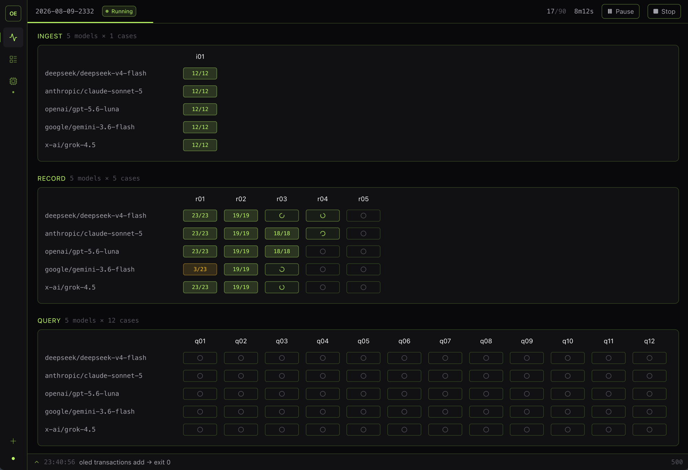

<h1 align="center">OpenLedger Evaluation</h1>

<p align="center">
  <strong>Measures how fit the OpenLedger CLI and SKILL.md are for AI models</strong>
</p>

<p align="center">
  Every eval run drives a ladder of models through OpenRouter against the real CLI in a sandbox, grades the results deterministically, and writes a cross-model performance.
</p>

<p align="center">
  
</p>

<br />

## The Three Suites

Every suite is scored by reading the ledger back, never by parsing prose.

### Ingest

A password-locked card statement, 126 rows. The model finds the file, runs
`oled ingest prepare`, reads the extracted text, posts every row with
`oled ingest commit`, then resolves what the ledger flagged. Twelve assertions
check the ledger against the statement's own fact file: row counts, group
totals, uncategorized ratio, open questions, file lifecycle, net worth.

### Record

The same job with nothing to extract. Transactions arrive as a random markdown
table, a scribbled note, an unknown financial CSV export. Five cases of 20 to 50
rows, and the prompt never says how many. Turn caps sit below the row count in
two of them, forcing batches, and one case is in a currency the sandbox has no
ledger for, so its first commit is refused and the model has to open one and
retry.

Scoring counts every date and amount and checks every balance, so merged, split
or misdated rows fail even where the totals still tie. Nothing may be left
uncategorized, forced into an adjustments account, or asked and unanswered.
Descriptions are not scored. The journey is reported beside the checks and never
graded: turns, nonzero exits, refusals, repeated commands.

### Query

A sandbox seeded with 40 known transactions, one question, and `SKILL.md`. The
model answers with the CLI and must finish by calling `submit_answer`. Twelve
cases, from "how many transactions" to a paging case one page cannot answer and
a currency trap that fails any model that sums THB and USD. Goldens are
re-derived from the seed rows at startup; a mismatch refuses to run.

## Setup

1. `npm install -g oled`, so the CLI under test is on your PATH. For a local
   build, run `npm run build && npm link` in the openledger checkout instead.
   The eval takes whichever `oled` it finds, exactly as a user would.
2. `cp .env.example .env` and set `OPENROUTER_API_KEY`.
3. `npm install`.

Node 18+, macOS or Linux. If `oled --version` answers, you are ready; the
harness checks it at startup and refuses before spending anything.

## Run

The [dashboard](#dashboard) is the way in: pick a suite, tick the models, press
launch, watch the grid fill. It spawns `npm run eval`, which stands on its own
for a headless run.

```sh
npm run eval -- --suite all                        # every model, every suite
npm run eval -- --suite query --model deepseek/deepseek-v4-flash
npm run eval -- --into 2026-08-09-2328 --case q09  # one case, into an existing report
```

| Flag | Meaning |
| --- | --- |
| `--suite ingest\|record\|query\|all` | repeatable; default all |
| `--model <id>` | repeatable; overrides `models.json` |
| `--case <id>` | repeatable; only these cases |
| `--into <slug>` | merge into an existing report rather than start one |
| `--concurrency <n>` | parallel runs (default: one lane per model, capped at 8) |

Candidates come from `models.json`, a plain array of OpenRouter ids. An id the
endpoint does not know, or a model without tool calling, is skipped and listed
with its reason. Each case runs once. A second trial doubles a matrix that costs
real money and tells you little that a rerun would not.

Every run is hermetic: its own temp directory, its own home, its own config, no
`OLED_*` passed through. Nothing touches your real `~/.oled`. Exit 0 means every
run was graded (a failing grade is data); 1 means a run hit an endpoint or
sandbox error; 2 means bad usage.

## Reports

One invocation writes one iteration under `reports/<timestamp>/`:

- `leaderboard.md`, ranked per-suite tables: cases passed, pass rate, time,
  tokens, cost, tool calls. Committed, as the regression trail.
- `benchmark.json`, the same figures machine-readable, plus the identity every
  one of them was measured against: oled version, skill version and hash, a
  fingerprint of the questions and the answer contract, eval version. Committed.
- `runs/<model>/<suite>/<case>.json`, one per run: every assertion with its
  want/got evidence, metrics, counters, and the full transcript, down to what
  each `oled` call was piped and what it replied. Not committed.

A rerun merges back into the report it came from rather than starting a new
one. If it was measured against a different build (a newer `oled`, an edited
`SKILL.md`, a reworded question) it still lands, and the leaderboard says the
report spans more than one build rather than averaging across them in silence.

Cost is OpenRouter's published pricing times reported usage, and reads `—` when
the endpoint omitted usage.

## Dashboard

```sh
npm run dev                  # Vite (page) + the API, with hot reload
npm start                    # build the page, then serve everything from :4000
npm run dev:api -- --port 8080   # the API alone, on another port
```

In development the page is Vite's and the API is a second process, so open the
URL Vite prints. It binds `localhost` rather than `127.0.0.1`. `npm start` serves
both from one process on one port.

It is a reader of the same `reports/` directory and owns only the launch slot.
It listens on loopback. Starting a run and deleting a sandbox are the two things
that cost anything, and both are refused unless the request came from its own
page.

## License

[MIT](LICENSE) © Phureewat Aphibansri
